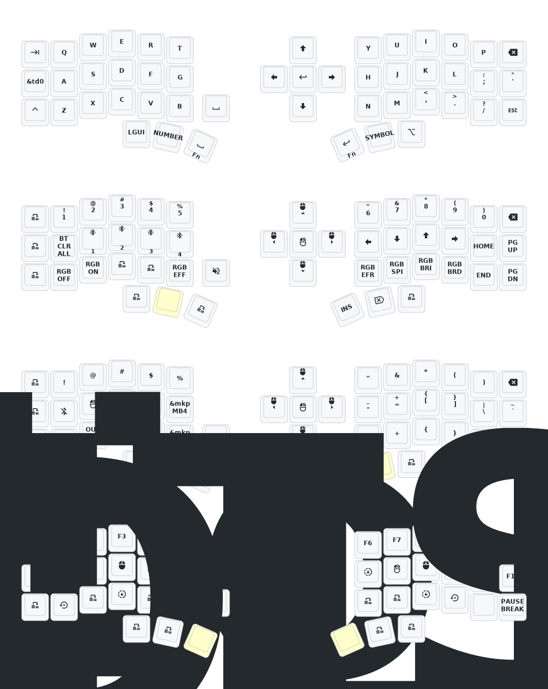

# (Eyelash Peripherals) Corne ZMK Repository

**This keyboard is not the same as [foostan's Corne](https://github.com/foostan/crkbd). It will not work with standard `corne` firmware.**


If you need a 3D model of this keyboard, email `380465425@qq.com`.

## Instructions

1. [Fork this repository](https://docs.github.com/en/get-started/quickstart/fork-a-repo#forking-a-repository).
2. [Click the **Actions** tab and make sure the workflow is enabled](https://docs.github.com/en/actions/managing-workflow-runs-and-deployments/managing-workflow-runs/disabling-and-enabling-a-workflow#enabling-a-workflow).
3. Make sure the `eyelash_corne` project in [`config/west.yml`](config/west.yml) still works. The `boards/arm/eyelash_corne` folder will be downloaded from this URL.
4. If there is still a `boards/arm/eyelash_corne` folder in your fork, delete it.

**If you already have a ZMK config repository, [you can add this one as a module instead of forking](https://zmk.dev/docs/features/modules#building-with-modules).**

## Keymap Diagram



```bash
podman volume create --driver local -o o=bind -o type=none \
 -o device="/data/projects/nomada-zmk/config/" zmk-config

podman volume create --driver local -o o=bind -o type=none \
 -o device="/data/projects/nomada-zmk/zephyr" zmk-modules


podman build -t zmknomada -f Dockerfile ./.devcontainer

podman run -it --rm \
  --security-opt label=disable \
  --workdir /workspaces/zmk \
  -v /data/projects/SANDBOX/zmk:/workspaces/zmk \
  -v zmk-modules:/workspaces/zmk-modules \
  -v zmk-config:/workspaces/zmk-config \
  -p 3000:3000 \
  zmknomada /bin/bash


west build -b eyelash_corne_left

west build -b eyelash_corne_left -- -DSHIELD=nice_view


west build -b eyelash_corne_left -- -DSHIELD=nice_view -DZMK_CONFIG=/workspaces/zmk-config

west build -b eyelash_corne_left -- -DZMK_CONFIG=/workspaces/zmk-config"

west build -d build/left -b eyelash_corne_left -- "-DSHIELD=nice_view -DZMK_CONFIG=/workspaces/zmk-config"


west build -s zmk/app -d "/tmp/tmp.vS2o3LPaoc" -b "eyelash_corne_left"  -- -DZMK_CONFIG=/tmp/zmk-config/config -DSHIELD="nice_view" -DZMK_EXTRA_MODULES='/__w/zmk-new_corne/zmk-new_corne' 

west build -s /workspaces/zmk/app -b "eyelash_corne_left"  -- -DZMK_CONFIG=/workspaces/zmk-config -DSHIELD="nice_view"

west build -b eyelash_corne_left -- -DSHIELD=nice_view
```